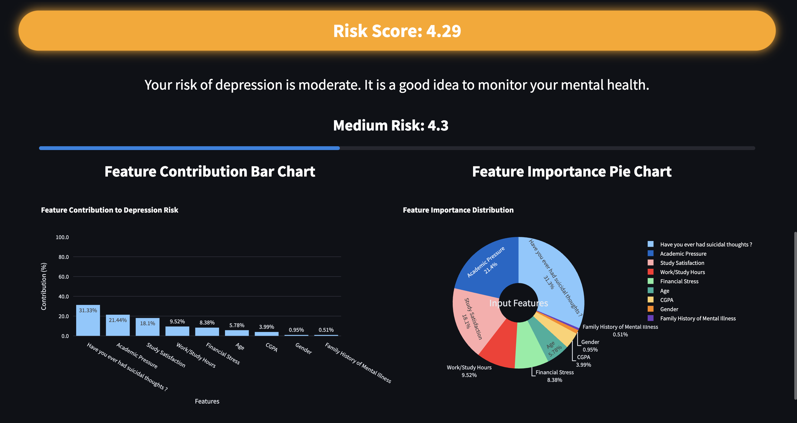

# MindCare

MindCare is a machine learning-powered web application designed to assess mental health status based on user inputs. By leveraging a Random Forest Classifier, the app predicts the likelihood of depression, providing users with insights into their mental well-being. The interactive interface is built using Streamlit, ensuring a user-friendly experience.

## Features

- **Random Forest Classifier**: Utilizes an ensemble learning method for accurate predictions.
- **Streamlit Web Interface**: Offers an intuitive and interactive user experience.
- **Data Visualization**: Presents predictions and related data in an understandable format.
- **User-Friendly Inputs**: Collects relevant information through simple form fields.

## Demo



## Installation

1. **Clone the Repository**:

   ```bash
   git clone https://github.com/Gaurav-04-06/MindCare.git
   cd MindCare
   ```

2. **Create a Virtual Environment** (Optional but recommended):

   ```bash
   python -m venv venv
   source venv/bin/activate  # On Windows: venv\Scripts\activate
   ```

3. **Install Dependencies**:

   ```bash
   pip install -r requirements.txt
   ```

## Usage

To run the application locally:

```bash
streamlit run main.py
```

After executing the above command, the app will be accessible in your web browser at `http://localhost:8501/`.

## Dataset

The model is trained on the `final_depression_dataset.csv`, which contains anonymized survey data related to mental health indicators.

## Model Details

- **Algorithm**: Random Forest Classifier
- **Libraries Used**: scikit-learn, pandas, numpy
- **Training Process**:
  - Data preprocessing and cleaning
  - Feature selection and engineering
  - Model training with cross-validation
  - Evaluation using metrics like accuracy, precision, recall, and F1-score

## File Structure

```plaintext
MindCare/
├── main.py                   # Streamlit application script
├── final_depression_dataset.csv  # Dataset used for training
├── mental_health_image.jpg   # Image displayed in the app
├── requirements.txt          # Python dependencies
└── README.md                 # Project documentation
```

## Contributing

Contributions are welcome! If you'd like to enhance the application or fix issues, please fork the repository and submit a pull request. For major changes, kindly open an issue first to discuss your ideas.

## License

This project is licensed under the MIT License. See the [LICENSE](LICENSE) file for details.

## Acknowledgements

- [Streamlit](https://streamlit.io/) for providing an easy-to-use framework for web applications.
- [scikit-learn](https://scikit-learn.org/) for machine learning tools and algorithms.

